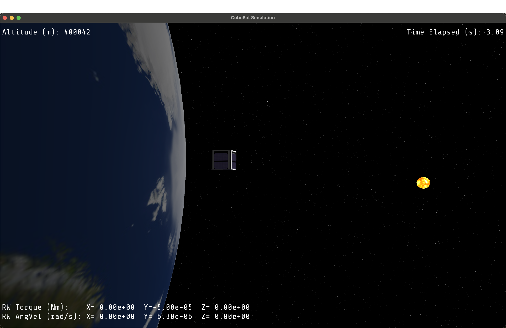
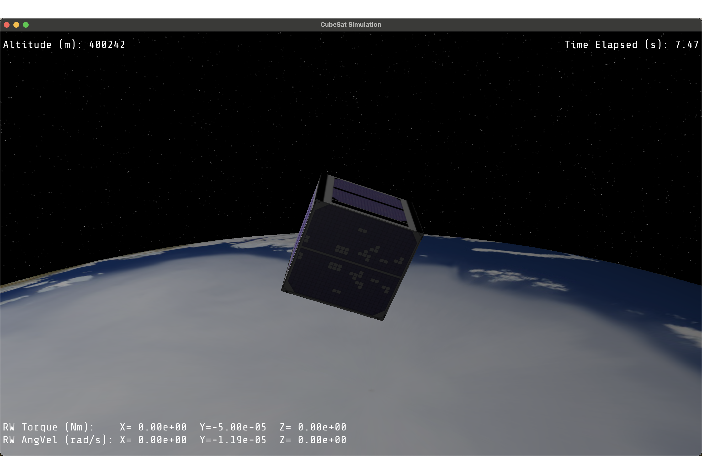
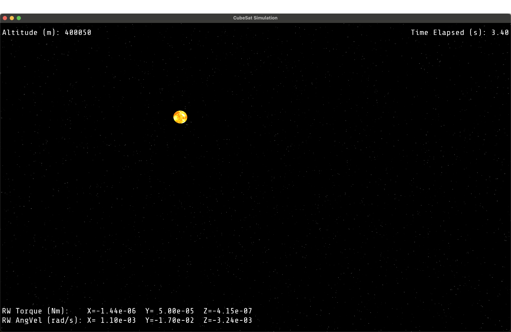
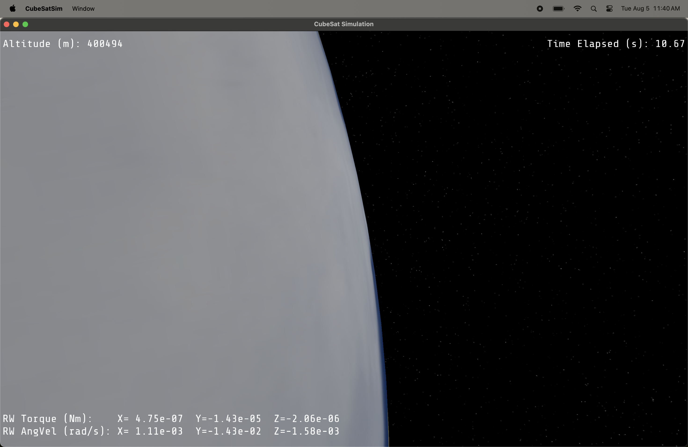
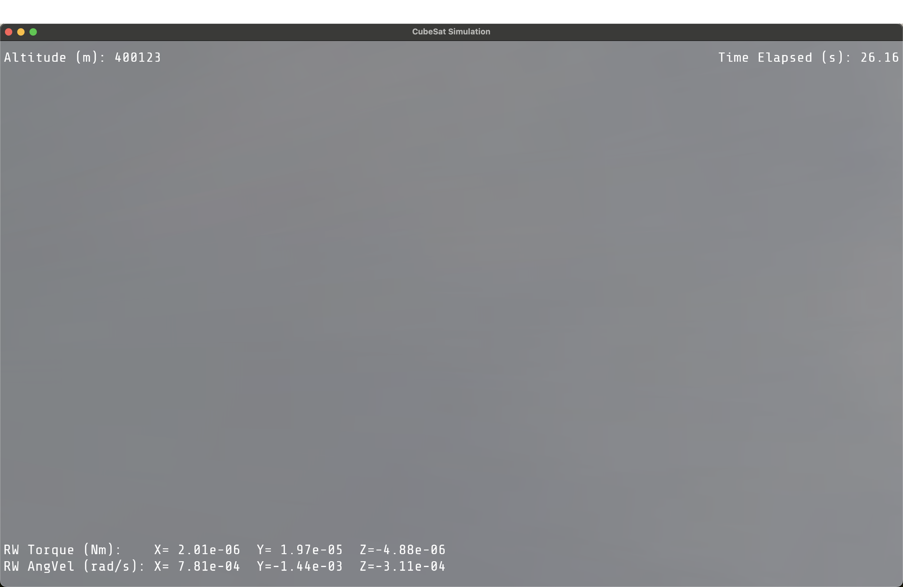
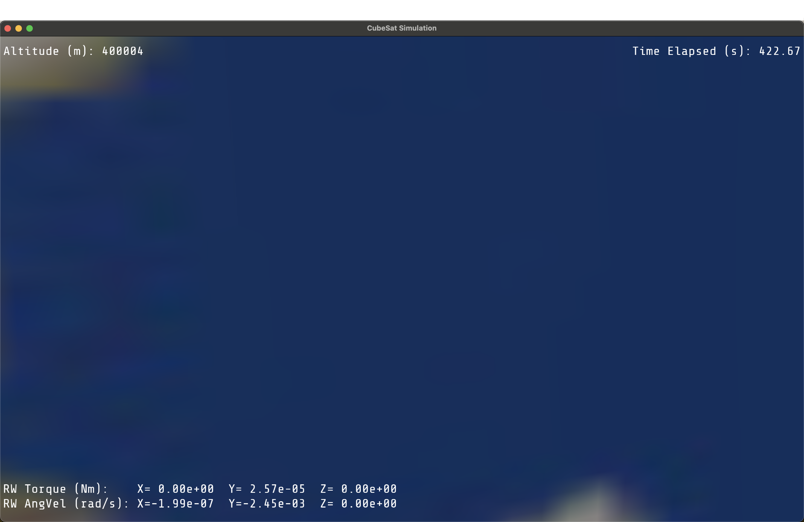

<h1 align="center">
  SIBC Amazon Spring 2026
  
 | 

  <a href="https://youtu.be/hR3Bsj9gUNY"><strong>Demo Video</strong></a>
</h1>

  

[Free View: Satellite reflects light on its sun-facing side]

[Follow Camera: Satellite centered against space and Earth backdrop]

  
  
  

[Onboard Camera: Reaction wheels calibrate the satellite to nadir-pointing orientation]

[Onboard Camera: Satellite maintains nadir-pointing orientation toward Earth's surface throughout orbit]

