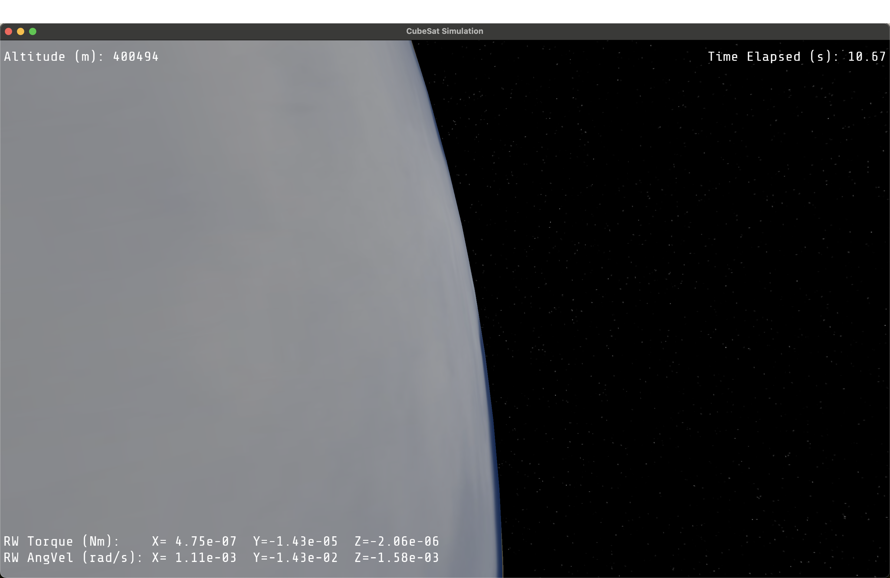

[Technical Overview (PDF)](./preview/satellite_technical_overview.pdf)
---
  

[Free View: Satellite reflects light on its sun-facing side]

[Follow Camera: Satellite centered against space and Earth backdrop]

  
  
  

[Onboard Camera: Satellite recalibrates to nadir-pointing orientation via reaction wheel torque]

[Onboard Camera: Satellite maintains nadir-pointing orientation toward Earth's surface throughout orbit]

